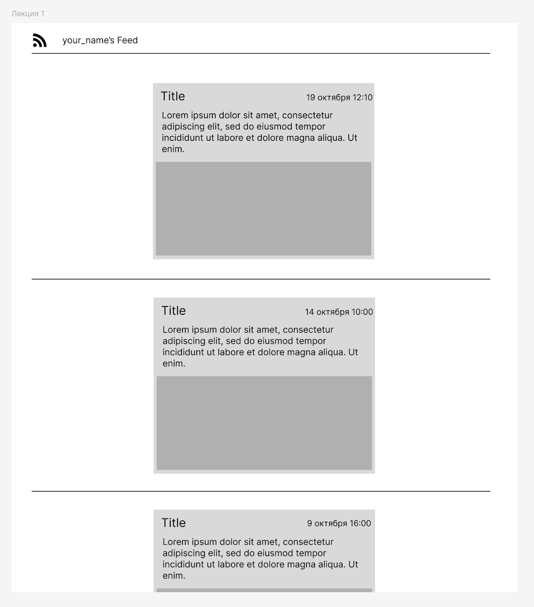
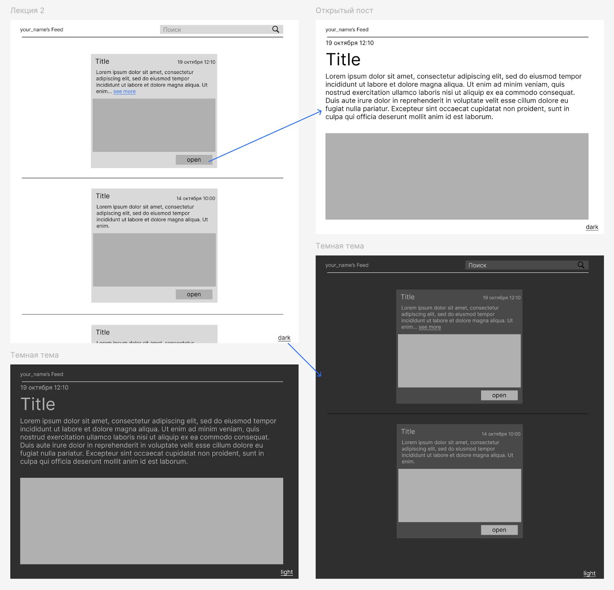
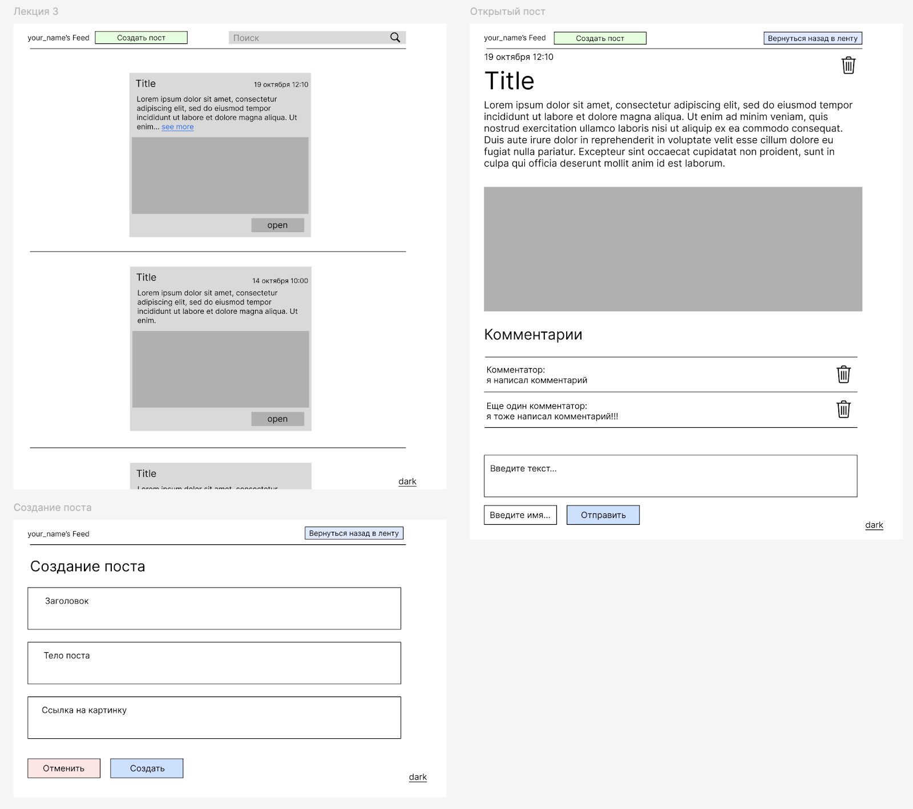

Знаю, что делаю коммиты после дедлайна. Буду рада, если проверите последний :)). Но у меня есть коммит и до дедлайна.

Задание: "React"
---

Цель задания:
- Сформировать знание о работе сборщиков и использовании React для создания пользовательских интерфейсов. 
- Сформировать понимание о том, как создавать компоненты, управлять состоянием, роутингом и контекстом в web-приложении на React. 
- Научиться создавать и дорабатывать функциональные web-приложения, используя React и его ключевые концепции.

> Что нужно сделать

## Часть 1. Реализация ленты новостей
### 1. Создание проекта:
Создать новый проект React с помощью `npm create vite` или другого сборщика.  
Запустить и убедиться, что в консоли нет ошибок и приложение открывается в браузере на localhost
### 2. Создание базовых компонентов:
- Создать компонент `Feed`, который будет отображать ленту новостей.
- Создать компонент `FeedItem` для отображения отдельной новости.
- Создать компонент `Header`, в котором написать свое имя
- Добавить вывод  компонентов Header и `Feed` в App.tsx
### 3. Работа с пропсами:
Передавать все данные о новости из `Feed` в `FeedItem` через пропсы.  
Данные для отображения постов взять отсюда: https://pastebin.com/tG2Ucdxx
### 4. Подключение стилей и работа с картинками:
Добавить стили для компонентов:
- Новости в ленте не должны быть на всю ширину экрана
- Заголовок и дата должны быть рядом на одной строке
- Картинка должна быть отцентрована по горизонтали

В `Header` добавить иконку: svg или png. Картинку добавить в репозиторий с кодом.

### 5. Работа с коллекциями и ключами:
Через метод `map` отображать ленту новостей. Убедиться, что каждый элемент имеет уникальный key.

Пример как должно получиться:

## Часть 2. Доработка ленты новостей

### 1. Управление состоянием:
Добавить состояние для скрытия/раскрытия длинного текста в постах с использованием хука `useState`.
Если текст больше 5 слов - он скрывается.
Добавить состояние для хранения массива постов с использованием хука `useState`.

### 2. Использование хуков:
Использовать хук `useEffect` для имитации загрузки данных новостей из API.
В нем делать setState(posts) с таймаутом в 1500мс.
Пока нет постов (состояние постов - `null`/`undefined`/`[]`) - выводить вместо ленты заглушку.
posts - объект, который импортировали раньше.
Использовать useMemo при фильтрации постов.

### 3. Добавление роутинга:
Установить библиотеку `react-router` и настроить роутинг для просмотра новости на отдельной странице.
Создать компонент &lt;Post /&gt; который будет является постом, открытым на весь экран.
Использовать `/post/:id` для роутинга постов на весь экран.
Страница с лентой должна оставаться в корневом пути `/`.

### 4. Работа с формами:
Добавить форму для фильтрации новостей по тексту из заголовка. Поместить форму в хедер. 
Добавить управление состоянием (Controlled Input) поля для поиска по заголовкам записей.
В форме должна быть SVG или PNG иконка поиска. Хранить иконку в коде (JSX или .png в репозитории).

### 5. Использование контекста:
Создать контекст для управления глобальным состоянием темы. Использовать его значение в компонентах. Тема в компонентах не должна передаваться через пропсы.
Создать кастомный хук `useTheme()` для работы с темой.
Добавить переключатель темы в правый нижний угол страницы. 

## Что должно получиться

Итоговый артефакт: 

Рабочее приложение ленты новостей с функциональностью просмотра списка новостей, фильтрации, а также маршрутизации и детализации новостей.   
Приложение должно быть структурировано и стилизовано, а также содержать примеры использования пропсов, состояния, хуков, роутинга и контекста.

## Часть 3. Перевод ленты новостей на Редакс

### Интеграция Redux для управления состоянием:
Перевести  управление состоянием приложения на Redux +  Redux Toolkit. 
Создать срез (slice) для управления списком новостей.
Создать store. Подключить  его к приложению.
Создать экшены добавления и удаления постов.
Реализовать возможность добавлять и удалять комментарии к постам в компоненте Post. Комментарии хранить в Redux сторе.
Для реализации добавления постов создать отдельный роут /create в котором должна быть форма с полями для ввода данных поста.
Добавить логирование событий изменения стора с помощью консольных логов и подписки на стор

### Работа с Axios для получения данных:
Заменить константный массив объектов с постами на получение данных из API с использованием Axios.
Получить данные можно по эндпоинту https://mocki.io/v1/cdeb6c5b-1b40-4af5-a21c-8ed15f45b32d
Создать свой инстанс Axios для выполнения запросов к https://mocki.io/v1 с таймаутом 3000мс
Использовать созданный инстанс Axios для выполнения GET-запроса к публичному API новостей.
Отобразить полученные данные в ленте новостей.

### Пример как должно получиться:

## Что должно получиться
Рабочее приложение ленты новостей с функциональностью просмотра списка новостей, фильтрации, а также маршрутизации и детализации новостей. 
Новости подгружаются из API. Новости можно создавать и удалять.  В новостях есть раздел комментариев, в котором можно их добавлять или удалять.
Всё динамичное состояние хранится в Redux с использованием redux-toolkit.
Приложение должно быть структурировано и стилизовано, а также содержать использование пропсов, состояния, хуков, роутинга, контекста и запросов к API.

## Как поделиться результатом работы
Закоммитить код в этот репозиторий

## Как будет оцениваться практическое задание
### 1. Качество кода (5 баллов):
- 5 баллов — Код структурирован, чистый, хорошо организован, следует принципам модульности и читаем. Имена переменных и функций осмысленные.
- 3-4 баллов — В коде минимальные проблемы с организацией, мелкие ошибки в стиле или структурировании.
- 1-2 баллов — Есть проблемы с организацией и читаемостью кода. Например, большое количество дублирующегося кода, несоответствие стандартам.
- 0 балла — Код плохо организован, сложно читать и поддерживать.
### 2. Функциональность (10 баллов):
- 10 баллов — Все функции работают корректно. Приложение соответствует требованиям, поддерживает фильтрацию, маршрутизацию и детализацию новостей.
- 7-9 баллов — Большинство функций работает, но есть незначительные недочеты или недостающие фичи.
- 4-6 баллов — Приложение работает частично, есть существенные недочеты в основной функциональности.
- 0-3 балла — Приложение не выполняет базовые функции или работает с критическими ошибками.
### 3. Использование React (10 баллов):
- 10 баллов — Пропсы, состояние, хуки, роутинг и контекст используются правильно и эффективно. Компоненты оптимизированы.
- 7-9 баллов — Некоторые недочеты в использовании хуков, пропсов или роутинга, но они не критичны для общей работы.
- 4-6 баллов — Основные концепции React используются неправильно или неполноценно, что влияет на функциональность.
- 0-3 балла — Ошибки в применении ключевых концепций React, серьезные проблемы с реализацией.
### 4. Дизайн и стилизация (5 баллов):
- 5 баллов — Приложение выглядит профессионально, дизайн удобен, все стили корректно подключены и адаптированы.
- 3-4 балла — Дизайн удовлетворительный, но есть небольшие проблемы с оформлением или визуальной структурой.
- 1-2 балла — Дизайн минимальный, интерфейс неудобный или неопрятный.
- 0 баллов — Стилизация практически отсутствует, дизайн не завершен.
### 5. Производительность и масштабируемость (5 баллов):
- 5 баллов — Приложение работает быстро, оптимизировано, легко масштабируется и поддерживается.
- 3-4 балла — Приложение работает стабильно, но есть небольшие проблемы с оптимизацией.
- 1-2 балла — Приложение работает медленно, с лагами или избыточной нагрузкой на ресурсы.
- 0 баллов — Приложение нестабильно или практически нерабочее.

